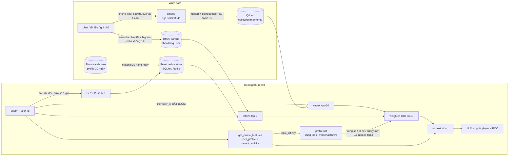

# HybridMemoryAgent: bộ nhớ cho trợ lý AI cá nhân tiếng Việt

**Contributors:** Phạm Long Nhật (2A202602844), làm một mình, có dùng Claude Code (xem log ở cuối).
**Chạy:** `python bonus/demo.py` (exit 0). Output đã lưu ở [`demo_output.txt`](demo_output.txt).

POC này ghép ba loại "trí nhớ" vào một context cho LLM:

| Trí nhớ | Câu hỏi nó trả lời | Lưu ở đâu | Lab concept |
|---|---|---|---|
| Episodic: chat, tài liệu đã đọc, ghi chú | "cái gì liên quan?" | Qdrant, hybrid BM25 + vector + RRF | NB1–NB3, NB5 |
| Stable profile: ngôn ngữ, tốc độ đọc, sở thích | "user là ai?" | Feast `user_profile`, batch, TTL 30 ngày | NB4 |
| Recent activity: query trong 1 giờ qua | "user đang làm gì?" | Feast `recent_activity`, Push API, TTL 1 giờ | §6 streaming |

## Sơ đồ kiến trúc

## Quyết định 1: Chunking (chọn: gom theo câu, ≤ 60 từ, overlap 1 câu)

Mình đã cân nhắc ba cách:

- **Mỗi tin nhắn là một chunk.** Cách này rẻ và giữ nguyên ranh giới tự nhiên. Nhưng tin nhắn chat tiếng Việt
  thường rất ngắn ("ok", "sửa được rồi"), embedding của chúng gần như là nhiễu, lại tốn một point mỗi tin.
- **Mỗi cuộc hội thoại là một chunk.** Cách này giữ đủ ngữ cảnh. Nhưng một vector phải gánh 5–10 chủ đề, rơi
  đúng vào "khoảng giữa các cụm" như câu hỏi ghép ở NB6. Thêm nữa, mỗi lần recall đổ cả cuộc hội thoại vào
  context window.
- **Gom theo câu, ≤ 60 từ, overlap 1 câu (chọn).** Mỗi chunk thường chỉ mang một ý, đủ ngắn để top-3 vừa
  khoảng 300 token context. Overlap 1 câu giữ được các đại từ kiểu "nó / cách này" nối sang câu sau.

**Tradeoff:** số point nhiều hơn so với cách chunk theo cuộc hội thoại (chi phí lưu trữ tăng, với 384d ×
float32 là khoảng 1,5 KB mỗi point), để đổi lấy precision cao hơn và context ngắn hơn. Với một người dùng cá
nhân (vài nghìn memory), chi phí lưu trữ không đáng kể, còn context window thì luôn khan hiếm.
Chọn 60 từ là vì bge-small cắt ở 512 token, mà tiếng Việt bị tokenizer tiếng Anh xé ra khoảng 3–4 token mỗi
âm tiết, nên 60 từ vẫn nằm an toàn dưới giới hạn đó.

## Quyết định 2: Feature schema và cách trộn vào retrieval

**Tabular features (chọn) hay embedding feature (vector sở thích ẩn học từ lịch sử)?** Mình chọn tabular:

| View | Feature | Nguồn | TTL |
|---|---|---|---|
| `user_profile` | `preferred_language`, `reading_speed_wpm`, `topic_affinity`, `active_hour` | batch, tính lại hằng ngày | 30 ngày |
| `recent_activity` | `queries_last_hour`, `top_topic_1h`, `last_query`, `avg_query_words_1h` | Push API | 1 giờ |

Lý do chọn tabular:
1. Feature tabular giải thích được và **sửa được bởi chính user**. Nghị định 13/2023 cho chủ thể dữ liệu
   quyền xem và chỉnh sửa dữ liệu của mình, và "bạn thích cloud" thì sửa được, còn một vector 384 chiều thì không.
2. Embedding feature phải index lại mỗi khi đổi model, giống hệt bài học NB2 và NB7.

TTL 1 giờ cho `recent_activity` là **có chủ đích**: quá 1 giờ thì Feast trả NULL. Đó là đúng nghĩa, vì
"query trong 1 giờ qua" mà lấy từ hôm qua thì là giá trị **sai**, không chỉ là cũ.

**Trộn profile vào ranking: weighted RRF với 3 danh sách** (BM25, vector, profile). Demo cho thấy hai cái bẫy:

- **k=60 quá lớn cho danh sách ngắn.** k=60 được chỉnh cho danh sách hàng trăm doc. Với mỗi user chỉ vài chục
  memory, 1/61 và 1/63 gần như bằng nhau, nên mọi tín hiệu phẳng ra và profile boost lấn át. Mình hạ xuống **k=10**.
- **Profile boost cố định thì sai với query có chủ đề rõ.** Lúc đầu mình đặt trọng số 0,5. Với query 5
  "Cho tôi summary cloud security", checklist security đứng **#1 ở cả BM25 lẫn vector** nhưng vẫn bị doc
  "chi phí cloud" vượt mặt, chỉ vì user thích `cloud`. Giờ trọng số profile là **1,0 khi query mở**
  ("Recommend đọc gì tiếp", không xác định được topic) và **0,1 khi query đã nói rõ topic**. Nguyên tắc:
  *query nói rõ thì tin query, query mơ hồ thì tin profile*.

## Quyết định 3: Freshness, 3 use case và 3 mức

| Use case | Mức chọn | Cơ chế | Vì sao không nhanh hơn / chậm hơn |
|---|---|---|---|
| "Tôi đang quan tâm gì gần đây?" | **Dưới 1 giây** | Feast **Push API** (đo được: push → đọc online **22 ms**) | Hỏi lại sau 5 phút mà không thấy câu vừa hỏi thì trợ lý trông "mất trí". Push chỉ 1 dòng mỗi query nên rẻ. |
| Vừa đọc xong tài liệu → "trợ lý nhớ gì về tôi?" | **Đồng bộ khi ghi, khoảng 1 giây** | `remember()` embed và upsert ngay (Qdrant ghi xong là đọc được) | Dồn batch 5 phút sẽ rẻ hơn, nhưng user vừa đọc xong là hỏi ngay, đây đúng là lúc trợ lý phải nhớ. |
| `topic_affinity`, `reading_speed_wpm` | **Hằng ngày** | batch → `materialize` (như NB4) | Đây là thống kê 30 ngày, một query không làm nó đổi. Cập nhật theo thời gian thực chỉ khiến profile "giật" theo từng câu hỏi. |

**Push sau khi đọc, không phải trước khi đọc.** `recall()` đọc feature trước rồi mới push query hiện tại. Nếu
push trước, câu "Tôi đang quan tâm gì gần đây?" sẽ thấy chính nó trong `last_query` (tự vọng lại). Ở query 3
của demo, `[recent]` liệt kê 2 query *trước đó*, đúng như mong muốn.

## Phương án đã cân nhắc và loại bỏ

- **Lưu episodic memory trong Feast (embedding feature view) thay vì Qdrant.** Mình loại vì vòng đời hai
  loại dữ liệu khác hẳn nhau. Memory được thêm liên tục (mỗi giờ) và cần ANN với filter, còn profile đổi theo
  ngày và tra theo key. Online store của Feast là key-value, không hỗ trợ "tìm 3 memory gần nhất".
- **Mỗi user một collection Qdrant.** Cách này cách ly mạnh, nhưng hàng triệu user tức là hàng triệu
  collection, mỗi collection tốn overhead index riêng. Mình chọn **một collection kèm filter `user_id` bắt
  buộc** trong code (`_hybrid()` luôn tạo filter, không có tham số để tắt), và demo `assert` rằng memory của
  `u_002` không bao giờ lọt vào kết quả của `u_001`. Đây là bài học rò rỉ tenant ở NB7. Cái giá phải trả là
  isolation chỉ "mềm", nên production cần thêm ít nhất một tầng nữa (xem phần hạn chế).
- **Dùng LLM để gắn topic.** Mình chọn bộ gắn keyword vì nó tất định, chạy không cần key và test được. Đổi
  lại, nó bỏ sót: lúc đầu doc HPA bị gắn `other` cho tới khi mình bổ sung "autoscal / co giãn / replica".

## Bối cảnh tiếng Việt

1. **Gõ không dấu.** Người dùng hay gõ "nghi dinh du lieu ca nhan". Phía tài liệu được index thêm **bản gấp
   dấu** cho từng token, còn query thì *không* gấp: query có dấu khớp chính xác, query không dấu thì vốn đã ở
   dạng gấp nên khớp được bản đó. Nếu gấp cả query thì "dữ" sẽ va với "đủ" và "dư". Va chạm đó vẫn còn với
   query không dấu: doc HPA chứa "đủ cao" nên lên #2 cho câu trên, đây là cái giá của việc gấp dấu.
2. **Tách từ: whitespace, pyvi hay underthesea.** Tiếng Việt tách theo dấu cách chỉ cho ra âm tiết, nên "tài
   liệu" và "dữ liệu" khớp nhau qua âm "liệu". Đó đúng là lý do doc Nghị định leo lên đầu ở query 4 trước khi
   có bigram. Mình chọn **bigram âm tiết** (`tài_liệu`, `hạ_tầng`) để xấp xỉ tách từ ghép mà không kéo thêm
   pyvi/underthesea (cần CRF model và thêm dependency). Nếu chấp nhận dependency, underthesea sẽ chính xác hơn.
3. **Trộn Anh–Việt (code-switching).** Câu kiểu "Recommend đọc gì tiếp" hay "summary cloud security". Có
   BM25 trong hybrid nên vẫn bắt được các từ tiếng Anh nguyên văn (Kubernetes, IAM) mà model đa ngữ đôi khi bỏ qua.
4. **Model embedding.** `bge-small-en` là model tiếng Anh. **Query 4 (paraphrase) thua vì vậy:** doc HPA đứng
   BM25 #1 nhưng chỉ vector #4, còn doc Nghị định đứng vector #1, và thua đúng 0,0035 RRF. Production phải dùng
   `bge-m3` (`EMBEDDING_BACKEND=bge-m3`, rồi index lại). POC không tải model 2,2 GB đó.
5. **Nghị định 13/2023/NĐ-CP.** Memory chứa dữ liệu cá nhân, có khi cả dữ liệu nhạy cảm (sức khoẻ, tài
   chính). User phải xoá được từng memory và toàn bộ profile, và dữ liệu không được chuyển ra nước ngoài
   khi chưa đánh giá tác động. Hai điểm này ảnh hưởng tới việc chọn region khi deploy (POC chưa xử lý).

## Kết quả demo (5 query, user `u_001`)

| # | Query | Kết quả | Đánh giá |
|---|---|---|---|
| 1 | Tôi đã đọc gì về Kubernetes? | chat CrashLoopBackOff (bm25#1 + vector#1) | ✅ |
| 2 | Recommend đọc gì tiếp | top-3 đều là `cloud`, khớp `topic_affinity` | ✅ nhờ profile |
| 3 | Tôi đang quan tâm gì gần đây? | `[recent] 2 queries…, mostly about cloud` | ✅ Push API |
| 4 | Tài liệu về tự động mở rộng hạ tầng? | HPA #2, thua doc Nghị định 0,0035 | ❌ do model tiếng Anh |
| 5 | Cho tôi summary cloud security | checklist security #1 | ✅ sau khi sửa trọng số profile |

## POC này chưa xử lý được gì

- **Cách ly theo user chỉ ở tầng ứng dụng.** Production cần thêm ít nhất một tầng: Qdrant multitenancy với
  payload index cho `user_id`, hoặc mã hoá riêng từng user.
- Chưa có **mã hoá khi lưu**; chưa có **CRUD** cho memory (xoá hay sửa từng cái, "quên tôi đi").
- Qdrant và corpus BM25 nằm trong RAM: restart là mất hết. BM25 dựng lại cho mỗi query (O(n) theo số memory
  của user), chấp nhận được với vài nghìn memory nhưng không phải hàng triệu.
- Chưa có **memory decay** (TTL hay lưu trữ lạnh memory lâu không dùng), **consolidation** (gộp các memory
  giống nhau), hay đồng bộ nhiều thiết bị.
- Cửa sổ 1 giờ của recent activity được tính trong RAM của agent. Production cần một stream processor
  (Flink hoặc Kafka Streams) để chịu được restart và chạy nhiều instance.
- Không gọi LLM: `recall()` chỉ trả về context string.

## Vibe-coding log

- **Prompt hiệu quả nhất:** *"In thứ hạng của từng retriever cạnh điểm RRF (`bm25#1+vector#4`)"*. Chỉ một dòng
  code mà biến output thành bằng chứng: nhờ nó mình thấy được rằng profile boost lật kết quả ở query 5, và
  query 4 thua vì vector chứ không vì BM25.
- **Prompt thất bại:** *"Gộp profile vào ranking bằng RRF"*. Kết quả đầu tiên là k=60 với trọng số cố định
  0,5. Code chạy được, trông hợp lý, nhưng lại xếp doc chi phí cloud lên trên checklist security. Đây là một
  silent regression mà chỉ đọc output từng query mới phát hiện ra.
